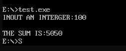
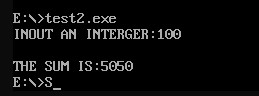
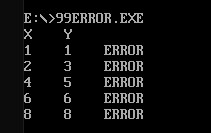
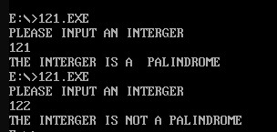
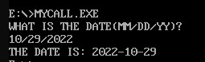
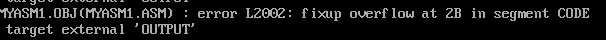
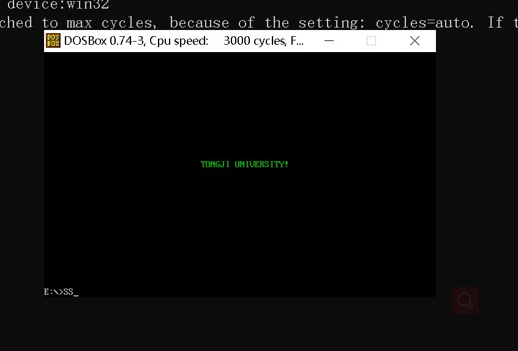

# assembly

my assembly homework
要求：
    - 代码注释包括时间、功能、方法、总结
    - 运行截图

## 累加1...100

- 运行结果

    
    

- 总结

    要善用通用寄存器和变量之间的处理；此外还要知道DOS命令寄存器的作用。

    LOOP更倾向于用已知条件执行；JXX则更灵活，且可以依据动态的数据。

    本次作业涉及有2个主要任务，一是累加，二是字符串和数字的转换。

    运用到的重要DOS指令有 01H,02H,09H；此外还有LOOP,PUSH,JXX指令。

    总之，至少让我更了解了8086的汇编指令的使用。
    不足之处有数据段的使用和理解，但也在和同学的交流之下收获良多。

## 九九乘法表的输出

- 要求
  - 利用过程和循环逻辑的实现方法
  - 结果显示图
  - 心得体会和遇到的问题
  - 提交exe和asm文件，截止时间10/26 24:00

- 运行结果
  - 
- 总结
  首先是全半角的问题，开头刚开始注释分号写错了以至于一直从头到尾的报错；

  第二是漏写指令导致循环跳不出来的问题以及JXX指令误写循环提早结束的问题，不过写完大致再修改的过程还是挺顺利的；

  由于这道题有结果的可预知性，所以我在设置变量上偷了个懒，可以看到输出的OO变量的特点，所以我后面为了**重置空格**，特地在输出之前写了两行指令。
  
  但这种做法和设计如果遇到数据不可预知的题目的时候是有很大问题的，且我尚不知在此基础上如何做出合适的改变。
  总之一切的一切就是为了完美的输出，所以变量取巧以争取时间上最快完成应该无可厚非吧……

## 九九乘法表的纠错

- 要求
  - 检查乘法表的数据是否准确，将不正确位置确定下来并且显示在屏幕上
  - 提交asm和exe文件，有详细注释
  - 心得和遇到的问题
  - 截止时间 10/26 24:00
- 运行结果
  - 

- 总结
  本次用到的方法有函数和跳转JXX；对于变量我力求及时更新，虽然这样可能多造成不必要的步骤，但是安全性、文件可读性和结果的可靠性得到了保障。此外，对于取偏移地址的做法我仍有不解之处，只能先继续用原来累加题目的方法；希望下次有所改善。

## 回文数判断--循环

- 要求
  - 检查回文数是否准确，并输出检查结果显示在屏幕上
  - 提交asm和exe文件，有详细注释
  - 心得和遇到的问题
  - 截止时间 10/30 24:00
- 运行结果
  - 

- 总结

  本次练习没有判断输入是否合法，只是简单判断了一下字符串的对称性。

## 过程调用练习

- 要求
  - 接收月/日/年的信息并显示年-月-日
  - 提交asm和exe文件
  - 心得和遇到的问题
  - 截止时间 10/30 24:00
- 运行结果
  - 

- 总结

  本次练习没有判断输入是否合法，对必须严格按照提示进行合理输出才可以输出成功，否则会出现奇怪的输出结果。
  调用call的时候，会先将下一步的IP地址压入栈中，等RET后再POP给IP继续执行。
  按照流程图，我没有想清楚DISP和DISPP有什么区别，或许是我忽略了数据的合法性才会如此。
  这一次用了两个地址寄存器SI和DI，没有出现报错，暂且不管。
  试了几次DEBUG，观察了一下SP的变化以及查看了对应地址的内容，应该是低地址对应低地址数据，高地址对应高地址数据。

## 子程序和多模块

- 本程序是将累加程序改写成多模块形式，也就是将一个源文件拆成多个源文件，并且注意数据、段、过程的使用问题。
- 暂时没有用到宏指令。
- 相关asm和exe文件请看 ./mul

### 程序结构

  一共有三个源程序文件，主要看过程调用：
  myasm1.asm

  ```asm
    extern shift:proc
    extern addp:proc
    extern output:proc
  ```

  myasm2.asm

  ```asm
    public shift
    public addp
  ```

  myasm3.asm

  ```asm
    public output
  ```

### 错误归纳

- ERROR L2002
  
  解决办法：
  1. 不同文件要想合并code和data段，需要在segment后面加 word public '段标识'
  2. PUBLIC和EXTERN要写在文件头部，不要写在过程里面

### 结果展示

  

### 总结

- 本次作业主程序调用的函数都是near的，call没有看到有压CS入栈；可以观察到debug的时候call myproc的myproc变成对应入口地址
- 不同文件的相同段要想不覆盖，需要加上public标识才行，否则link后会报L2002的错误。
- 有关public和extern的问题在masm的时候不会出现，在link的时候才会出现
- 使用的masm版本无法让proc带参数，所以想要过程带参数可能只有macrop可以，或者proc利用堆栈、变量等间接方式。
  
## 屏幕输出

- 要求
  清屏，并输出"TONGJI UNIVERSITY"字符串在指定位置。
- 完成时间  2022/11/20
- 代码和可执行文件在 ./io 文件夹下
- 效果展示
  
- 心得
  本次作业我主要利用了INT 10 中断下的各种功能。通过查表，我对显示模式、显示页号、设置光标、显示字符等各种功能有了了解以及简单的尝试。
  第一次循环使用当前光标下显示字符的时候，我忘记光标前移了，效果不是在同一个地方覆盖字符，而是像把先前的字符往前推了一样，结果字符串倒序输出了。
  代码结构其实很简单，就是设置好显示模式和显示页后，使用06H清屏，最后LOOP输出字符串。