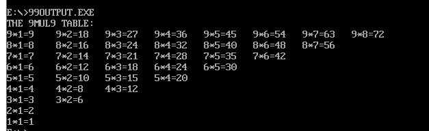

# assembly

my assembly homework
要求：
    - 代码注释包括时间、功能、方法、总结
    - 运行截图

## 累加1...100

- 运行结果

    
    

- 总结

    要善用通用寄存器和变量之间的处理；此外还要知道DOS命令寄存器的作用。

    LOOP更倾向于用已知条件执行；JXX则更灵活，且可以依据动态的数据。

    本次作业涉及有2个主要任务，一是累加，二是字符串和数字的转换。

    运用到的重要DOS指令有 01H,02H,09H；此外还有LOOP,PUSH,JXX指令。

    总之，至少让我更了解了8086的汇编指令的使用。
    不足之处有数据段的使用和理解，但也在和同学的交流之下收获良多。

## 九九乘法表的输出

- 要求
  - 利用过程和循环逻辑的实现方法
  - 结果显示图
  - 心得体会和遇到的问题
  - 提交exe和asm文件，截止时间10/26 24:00

- 运行结果
  - 
- 总结
  首先是全半角的问题，开头刚开始注释分号写错了以至于一直从头到尾的报错；

  第二是漏写指令导致循环跳不出来的问题以及JXX指令误写循环提早结束的问题，不过写完大致再修改的过程还是挺顺利的；

  由于这道题有结果的可预知性，所以我在设置变量上偷了个懒，可以看到输出的OO变量的特点，所以我后面为了**重置空格**，特地在输出之前写了两行指令。
  
  但这种做法和设计如果遇到数据不可预知的题目的时候是有很大问题的，且我尚不知在此基础上如何做出合适的改变。
  总之一切的一切就是为了完美的输出，所以变量取巧以争取时间上最快完成应该无可厚非吧……

## 九九乘法表的纠错

- 要求
  - 检查乘法表的数据是否准确，将不正确位置确定下来并且显示在屏幕上
  - 提交asm和exe文件，有详细注释
  - 心得和遇到的问题
  - 截止时间 10/26 24:00
- 运行结果
  - 

- 总结
  本次用到的方法有函数和跳转JXX；对于变量我力求及时更新，虽然这样可能多造成不必要的步骤，但是安全性、文件可读性和结果的可靠性得到了保障。此外，对于取偏移地址的做法我仍有不解之处，只能先继续用原来累加题目的方法；希望下次有所改善。
